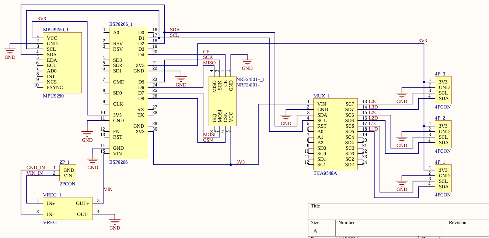
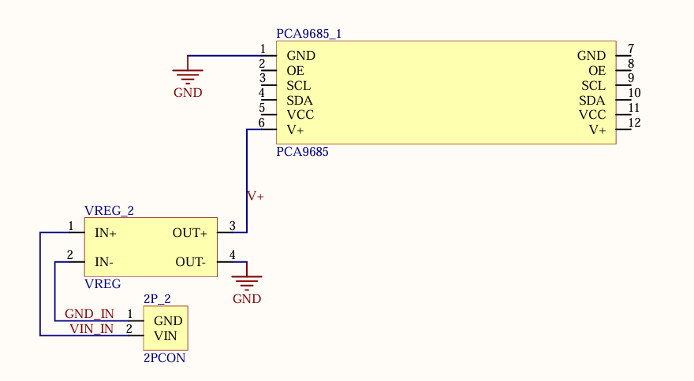
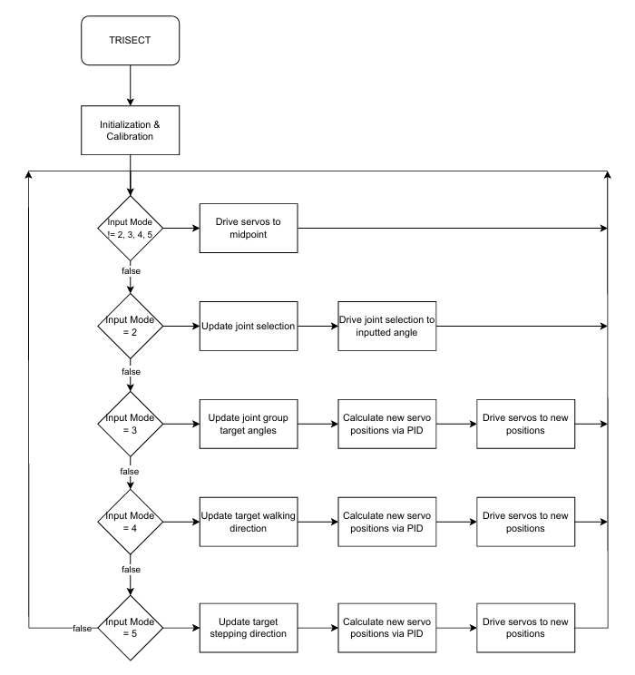

# Final project proposal

- [x] I have reviewed the project guidelines.
- [x] I will be working alone on this project.
- [x] No significant portion of this project will be (or has been) used in other course work.

## Embedded System Description

The goal of my final project is to implement an ESP8266 as a master controller, receiving data from 7 external IMU sensors via I2C, as well as commands from a wireless transceiver to control actuation of 18 servos driven by three seperate servo drivers in order to smoothly control a tripedal robot called TRISECT (TRIpedal Integrated System for Experimental Control and Testing) in varying degrees of complex control schemes detailed below. 

Each leg of the tripedal robot is a simple two segment limb with direct drive servos at each joint. The hip joint will have 2 degrees of freedom (1 180° & 1 270° actuation range) and the knee joint will have one (270° actuation range). There will be an IMU sensor (MPU6050) mounted at the midpoint of each segment of each leg providing 6 axis (Accelerometer & Gyroscope) input readings during operation via an I2C bus. Each leg will have its own servo driver (PCA9685) output controlling the 6 servos on each leg (2 servos per DOF, 18 total). 

The centeral body of the robot will house the controller, the ESP8266, as well as a centeral IMU (MPU9250) providing a 9 axis (Accelerometer, Gyroscope, & Magnetomoeter) input data via I2C. The body will also house a wireless transceiver (NRF24L01+) which will recieve commands from an external remote control. The body will also house an I2C multiplexer (TCA9548A) in order to enable communication between all sensors. (Note: The MPU6050s and the MPU9250 can only have addresses 0x68 or 0x69, facilitating the need for 4 seperate I2C busses) 

The whole system will be powered by a pair of 18650 Lithium Ion batteries in series, providing 7.4V DC, stepped down to 6V DC via a voltage regulator (LM2596). Each leg will also have a pair of series 18650s as power for the servos, each with their own voltage regulator (LM2596).

## Hardware Setup

Circuit Diagram Documentation can be found in planning/circuit_diagrams. Custom PCB design included.

Main Body:

Leg:

## Software overview

High level flowchart can be found in planning/flowcharts.

The software will have at minimum 3 modes of operation:

1.  Startup
2.  Individual Direct Control
3.  Symmetric Direct Control
4.  Advanced Control
5.  Experimental Control

The system transitions between modes based on specific commands received via the NRF24L01+ from the remote control.

- Startup: Upon system initialization, operation will begin in Startup mode. In Startup, each leg is powered, with each joint at the midpoint of it's actuation range. No servos will move from this position until switching to a different mode of operation.

- Individual Direct Control: Once switched into Individual Direct Control mode, based on specified inputs from the wireless transceiver a single joint will be under control at one time. Input from the remote control joystick will then actuate the selected joint.

- Symmetric Direct Control: Once switched into Symmetric Direct Control mode, based on specified inputs from the wireless transceiver, each joint type (Knee, Hip, Hip Pivot) will react to input from the remote control joystick. The IMU sensors will provide a feedback loop on which a PID (or similar) control scheme will enable smooth and predictable actuation.

- Advanced Control: This bonus control mode will abstract away the individual joints and joint groups, relying on inverse kinematics and an advanced PID control schema to attempt to crab walk in an optimistically graceful yet quick motion.

- Experimental Control: This bonus control mode is the pinnacle of this project. If achieved, the system will be capable of stepping utilizing the experimental gait initially designed and presented by the STriDER team at RoMeLa (UCLA (Formerly Virginia Tech) Robotics Lab). While they pioneered this gait in 2007, they never developed a system capable of performing the gait without passive dynamic locomotion. (Note: The implementation of passive dynamic locomtion was the main focus of the STriDER project. In no way am I suggesting that they failed!) I intend to implement this gait with direct drive actuation of each joint at all times. Check out the [video here!](https://youtu.be/7XsaJwKKBYo?si=tUSaFY6jGtXLBAKC "STriDER")

## Testing Procedure

In order to test and verify success, at minimum the first 3 modes of operation will be demoed. First Startup, a stable state in which to initialize and calibrate the system. Next, Individual Direct Control, demonstrating accurate control over each unique joint. And Finally, Symmetric Direct Control, demonstrating a smooth PID (or similar) based control loop driving each leg symmetrically.

Success Criteria:

- Startup: All servos initialize at midpoints, and IMUs calibrate without errors.
- Individual Direct Control: Each joint moves accurately (±2°) to remote joystick inputs.
- Symmetric Direct Control: All joints of a type (e.g., knees) move symmetrically, with IMU-based PID (or similar) adjusting servo angles to maintain a stable standing posture for at least 10 seconds.

Demo Setup:

I'll bring the robot and controller to demonstrate mode transitions and stability on a flat surface. No extra equipment is needed.

Stretch Goals:

Implementation of Advanced Control schema or Experimental Control schema as outlined previously!

## Prescaler

Desired Prescaler level: 

- [x] 100%
- [ ] 95% 
- [ ] 90% 
- [ ] 85% 
- [ ] 80% 
- [ ] 75% 

### Prescalar requirements 

**The inputs to the system will be:**
1.  MPU9250 9 axis IMU sensor mounted to the main body.
2.  MPU6050 6 axis IMU sensor mounted to Leg 1 Segment 1.
3.  MPU6050 6 axis IMU sensor mounted to Leg 1 Segment 2.
4.  MPU6050 6 axis IMU sensor mounted to Leg 2 Segment 1.
5.  MPU6050 6 axis IMU sensor mounted to Leg 2 Segment 2.
6.  MPU6050 6 axis IMU sensor mounted to Leg 3 Segment 1.
7.  MPU6050 6 axis IMU sensor mounted to Leg 3 Segment 2.
8.  NRF24L01+ wireless radio module mounted to the main body.
9.  (OPTIONAL) Contact sensor mounted on the foot of Leg 1.
10. (OPTIONAL) Contact sensor mounted on the foot of Leg 2.
11. (OPTIONAL) Contact sensor mounted on the foot of Leg 3.

**The outputs of the system will be:**
1.   PCA9685 Servo Driver actuating 6 individual servos on Leg 1.
2.   PCA9685 Servo Driver actuating 6 individual servos on Leg 2.
3.   PCA9685 Servo Driver actuating 6 individual servos on Leg 3.
4.   NRF24L01+ wireless radio module mounted to the main body.
5.   (OPTIONAL) RGB LED strip mounted on the main body.

**The project objective is**

Using data from 7 seperate IMUs, accurately and smoothly acuate 18 individual servos via PID control in order to enable a tripedal robot to stand and respond to wireless remote commands.

**The new hardware or software modules are:**
1. ESP8266 MCU hardware module: New microcontroller platform for main control of the system.
2. TCA9548A hardware module: New I2C Multiplexer for effectively facilitating communication between all slave devices.
3. IMU9250 hardware module: 9 axis IMU responsible for accurate 9 axis measurement of the centeral body.
4. IMU6050 hardware module: 6 axis IMU responsible for accurate 6 axis measurement each limb segment.
5. PCA9685 hardware module: Servo driver responsible for actuating 6 unique servos to control each leg.
6. NRF24L01+ hardware module: Wireless transceiver responsible for communicating between the robot and the remote control.

The Master will be responsible for:

All operation logic, including but not limited to data parsing, mode switching, PID calculations, and individual servo setting assignments.

The Slave(s) will be responsible for:

Collection and relay of IMU data, as well as coordination between robot and remote control.

### Argument for Desired Prescaler

Given the guidelines layed out, the complexity of this project exceeds the requirements for the 100% prescalar. 

- There are at a minimum 8 unique inputs. 
- There are at a minimum 4 unique outputs. 
- The system is built entirely around a master/slave topology. 
- The real objective is outlined: the system must be able to be controlled completely with a PID control schema and at minimum be able to stand on its own!
- There are at a mimimum 3 new hardware or sofware modules that have not been used beofre in EELE 465 or EELE 371. 
- The new hardware is quite complex to implement, requiring new systems such as an I2C multiplexer and an entirely new MCU.
